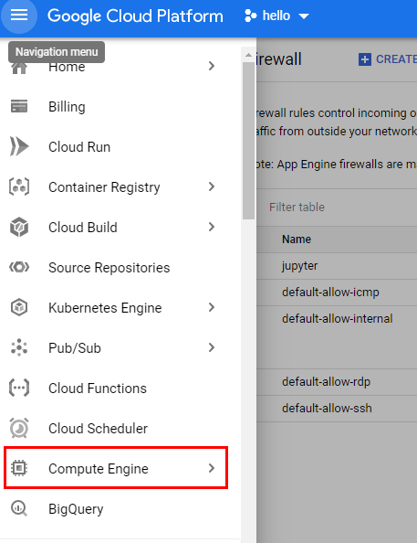
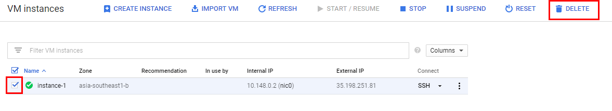

<p align="center">
  <a href="" rel="noopener">
 </a>
 <br>

</p>

<h3 align="center">GCP Compute Engine Tutorial with Hadoop</h3>

<div align="center">

[]()
[](https://github.com/da-huin/hadoop-tutorial/issues)
[](https://github.com/da-huin/hadoop-tutorial/pulls)
[](/LICENSE)

</div>

---

<p align="center"> 
    <br> In this tutorial, We will do Integrating Python with Hadoop on Google Cloud Platform with docker.
</p>

## 📝 Table of Contents

- [Getting Started](#getting_started)
- [Acknowledgments](#acknowledgement)

## 🏁 Getting Started <a name = "getting_started"></a>

1. **Click `Compute Engine button` in GCP console navigation**

    

1. **Click `Create Instance` button**

    

1. **Select your Region and Select your instance type.** 

    

1. **Change your Instance OS**

    

    

1. **Click `Management, security, disks, networking, solo tenancy button`.**

    

1. **Click `Networking` Tab and add Network tag `jupyter` and create.**

    Why we use `jupyter` tag?

    * We will soon create a firewall rule and apply it to the tag `jupyter`.

    

1. Click `View network details button`.

    

1. Click `Firewall` button in navigation and `Create Firewall Rule.`

    

1. Fill the `Name` form and Fill the `Target tags` as `jupyter`.

    * `jupyter` tag used on early created instance.

    

1. Fill that forms.

    Why Source IP ranges is used 0.0.0.0/0 ?

    * It means that the instance will open it to the outside world.

    Why use 8888 port?

    * the 8888 port will be use as a jupyter notebook port.

    

1. Click `Compute Engine Button` in Navigation. 

    

1. Click `SSH` Button.

    

1. Instance will be opened. now we need to enter a few commands.

    

1. Get `root` authority.

    ```
    sudo -s
    ```

1. Install Docker

    ```
    apt-get update -y && apt-get install docker.io -y
    ```

1. Run `Hadoop` with docker.

    ```bash
    docker run -p 9090:9090 --name=hbase-docker -d -v $pwd/data:/data dajobe/hbase
    ```

    * Result:

        ```
        ...

        Digest: sha256:daa36a6d90b118ced866b6c76fcd918e7da73302b0e4971f506f0f61f645a9fe
        Status: Downloaded newer image for dajobe/hbase:latest
        e62ec53474fc9fc9ee43f47e3af6177dac1b67d6330901f4da3f6b13f20e0885    
        ```
    
    Why use open 9090 port? 

    * because the 9090 port is the hadoop api port.

    What is dajobe/hbase? 

    * It is an OS container created in advance to easily install and use hadoop created by a user called dajobe.    

1. Run `Jupyter notebook` with docker and copy `token`.

    ```bash
    docker run -v $pwd/workspace:/workspace --net host -it --rm -d --name lab dahuin000/lab && docker logs -f lab
    ```
    * Result:

        ```
        ...

        To access the notebook, open this file in a browser:
            file:///root/.local/share/jupyter/runtime/nbserver-8-open.html
        Or copy and paste one of these URLs:
            http://instance-1:8888/?token=e74d7144715699f94516fd9626b24aac2ca254e309882474
        or http://127.0.0.1:8888/?token=e74d7144715699f94516fd9626b24aac2ca254e309882474
        ```

    What is dahuin000/lab?

    * It is an OS container created in advance to easily install and use jupyterlab notebook created by a user called dahuin000.    


1. Remember your `Instance IP` in GCP console and combine `IP` and `token` as shown in the `URL` below.

    

    http://`YOUR_IP_HERE`:8888/?token=`YOUR_TOKEN_HERE`


1. Connect your jupyter notebook with combined URL and enter the workspace directory.

    

1. Create python file.

    


1. Now we need to enter a few codes.

1. Install `happybase`

    ```
    !pip install happybase
    ```

    

1. Use the code below to prove that Hadoop is installed.

    ```python
    import happybase
    connection = happybase.Connection("localhost", 9090)

    print("* The connection to Hadoop in Goolge Cloud Platform has been established successfully.")

    table_name = b"sample-table"

    if table_name not in connection.tables():
        
        connection.create_table(table_name, {"family": dict()})
        print(f"The {table_name} created.")
        
    print("* Tables currently in Hadoop: ", connection.tables())

    # Get table handler.
    table = connection.table(table_name)
    print(f"* We got {table_name} handler.")

    # Put row.
    table.put("sample-rowkey", {"family:qual1": "value1", "family:qual2": "value2"})

    print("* We have saved json data in [some-rowkey]")

    # Get list of rows.
    print("* We will check if the data is well stored.")

    for k, data in table.scan():
        print("\n\tKey Name: ", k)
        print("\tData: ", data, "\n")

    print("* We have completed the test on Hadoop integration!")
    ```

    * result:

        ```
        * The connection to Hadoop in Goolge Cloud Platform has been established successfully.
        * Tables currently in Hadoop:  [b'sample-table']
        * We got b'sample-table' handler.
        * We have saved json data in [some-rowkey]
        * We will check if the data is well stored.

            Key Name:  b'sample-rowkey'
            Data:  {b'family:qual1': b'value1', b'family:qual2': b'value2'} 

        * We have completed the test on Hadoop integration!        
        ```

1. Delete Your Instance for clean up at https://console.cloud.google.com/compute/instances


    

1. Delete your Network for clean up at https://console.cloud.google.com/networking/firewalls/list

    
    
## **Tutorial is over 😀**
